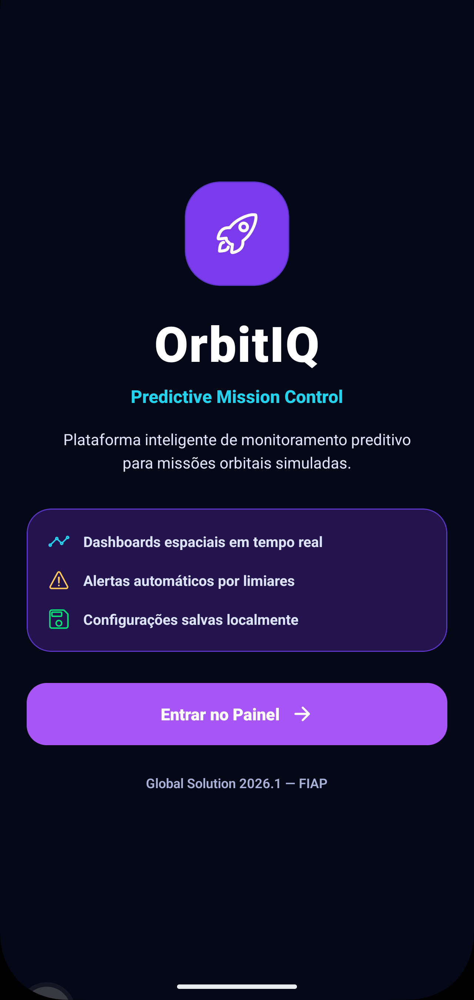
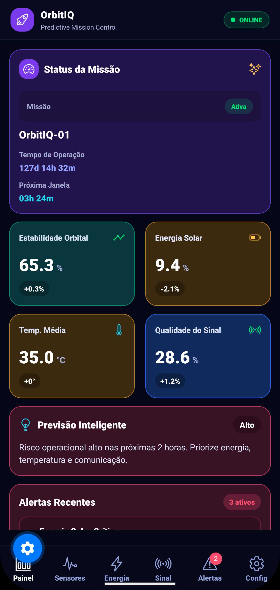
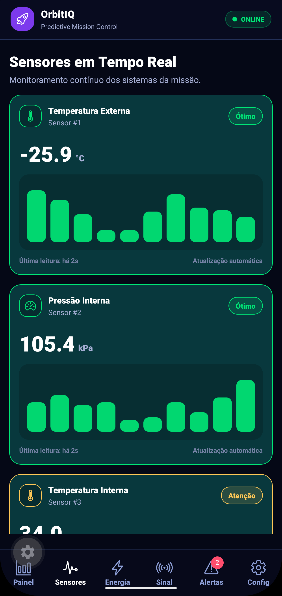
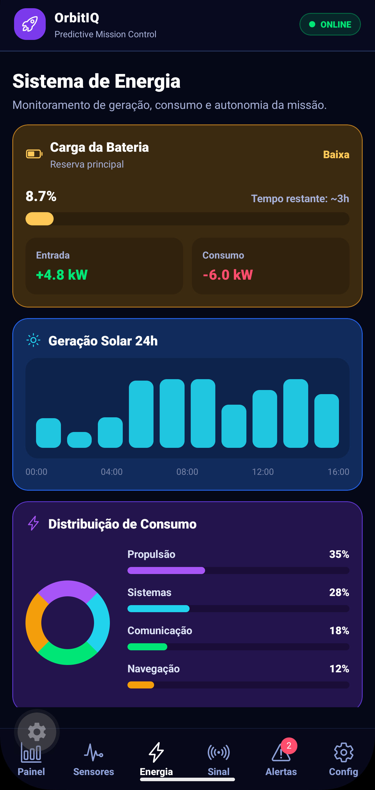
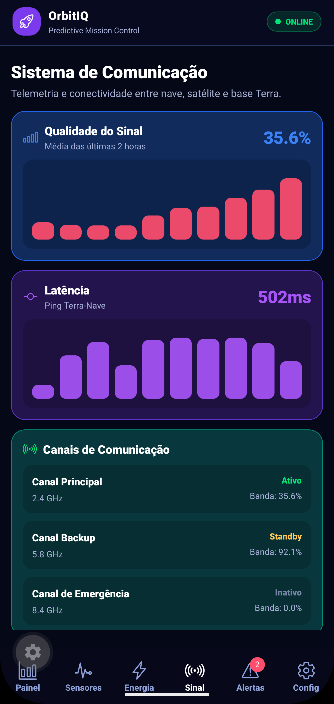
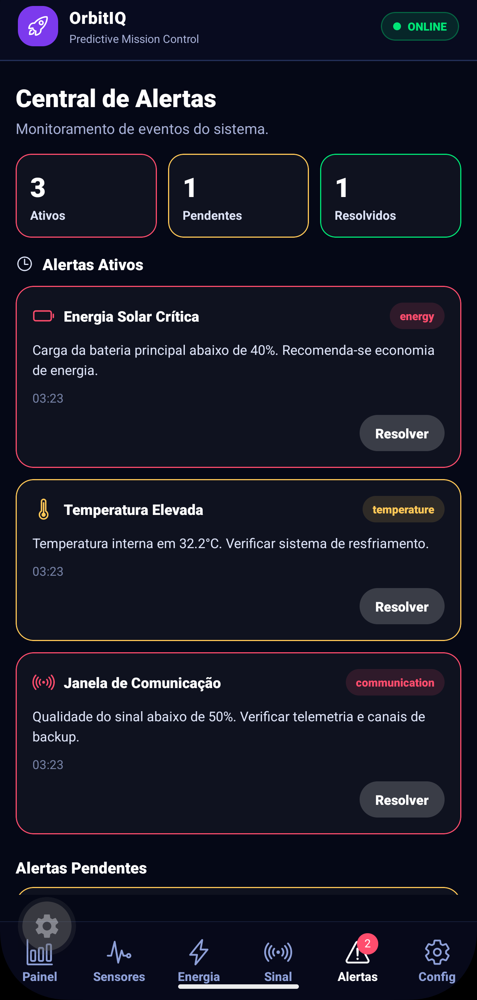
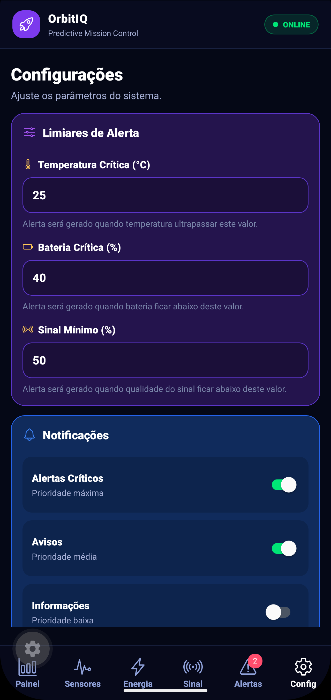

# OrbitIQ

### Global Solution 2026.1 — Cross-Platform Application Development | FIAP

<p align="center">
  <strong>Predictive Mission Control</strong><br>
  Plataforma mobile de monitoramento preditivo para missões orbitais simuladas.
</p>

---

## Descrição

O **OrbitIQ** é um aplicativo mobile desenvolvido em **React Native + Expo** para simular uma plataforma inteligente de monitoramento e análise preditiva de uma missão espacial.

A solução apresenta dashboards operacionais com dados simulados de sensores, energia, comunicação e estabilidade orbital, permitindo o acompanhamento de indicadores críticos em tempo real. Além disso, o app gera alertas automáticos com base em limiares configuráveis, auxiliando operadores na tomada de decisão em ambientes espaciais simulados.

O diferencial do OrbitIQ está na combinação de uma interface temática inspirada em centros de controle aeroespacial com funcionalidades reais de navegação, estado global, persistência local, formulário validado, alertas automáticos e previsão inteligente de risco operacional.

---

## Equipe

| Nome | RM |
|------|----|
| João Pedro de Moura Albino | RM565323 |
| Kauê Silva Matheus | RM561675 |
| Giovanna Fernandes Pereira | RM565434 |

---

## Telas do Aplicativo

<table>
  <tr>
    <td align="center">
      <strong>Entrada</strong><br>
      <br>
      <sub>Apresentação do app e acesso ao painel.</sub>
    </td>
    <td align="center">
      <strong>Painel</strong><br>
      <br>
      <sub>Status geral da missão e previsão inteligente.</sub>
    </td>
    <td align="center">
      <strong>Sensores</strong><br>
      <br>
      <sub>Monitoramento de sensores em tempo real simulado.</sub>
    </td>
  </tr>
  <tr>
    <td align="center">
      <strong>Energia</strong><br>
      <br>
      <sub>Bateria, consumo, entrada e geração solar.</sub>
    </td>
    <td align="center">
      <strong>Sinal</strong><br>
      <br>
      <sub>Comunicação orbital, latência e canais ativos.</sub>
    </td>
    <td align="center">
      <strong>Alertas</strong><br>
      <br>
      <sub>Eventos ativos, pendentes e resolvidos.</sub>
    </td>
  </tr>
  <tr>
    <td align="center">
      <strong>Configurações</strong><br>
      <br>
      <sub>Formulário de limiares e preferências salvas.</sub>
    </td>
    <td align="center" colspan="2">
      <strong>OrbitIQ</strong><br>
      <sub>Interface mobile temática espacial com dashboards funcionais, alertas automáticos, Context API e persistência local.</sub>
    </td>
  </tr>
</table>

---

## Funcionalidades

- [x] Tela de entrada com apresentação do OrbitIQ
- [x] Dashboard principal com status da missão espacial simulada
- [x] Monitoramento de sensores em tempo real simulado
- [x] Dashboard de energia com carga, consumo e geração solar
- [x] Dashboard de comunicação com sinal, latência, perda de pacotes e canais ativos
- [x] Sistema automático de alertas por limiares críticos
- [x] Tela de alertas com eventos ativos, pendentes e resolvidos
- [x] Botão para resolver alertas ativos
- [x] Formulário de configuração com validação de campos
- [x] Persistência de configurações com AsyncStorage
- [x] Gerenciamento de estado global com Context API
- [x] Navegação por abas utilizando Expo Router
- [x] Interface temática espacial com identidade visual escura/neon
- [x] Dados simulados atualizados automaticamente
- [x] Previsão inteligente de risco operacional com base nos indicadores da missão

---

## Tecnologias Utilizadas

- React Native
- Expo
- Expo Router
- TypeScript
- Context API
- AsyncStorage
- React Hooks
- Expo Vector Icons
- Git e GitHub

---

## Estrutura do Projeto

> Observação: o projeto Expo está dentro da pasta `OrbitIQ/` no repositório.

```txt
GS_CP_OrbitIQ/
├── README.md
└── OrbitIQ/
    ├── assets/
    │   ├── images/
    │   └── screenshots/
    │       ├── entrada.png
    │       ├── painel.png
    │       ├── sensores.png
    │       ├── energia.png
    │       ├── sinal.png
    │       ├── alertas.png
    │       └── configuracoes.png
    ├── scripts/
    ├── src/
    │   ├── app/
    │   │   ├── _layout.tsx
    │   │   ├── index.tsx
    │   │   └── (tabs)/
    │   │       ├── _layout.tsx
    │   │       ├── dashboard.tsx
    │   │       ├── sensors.tsx
    │   │       ├── energy.tsx
    │   │       ├── signal.tsx
    │   │       ├── alerts.tsx
    │   │       └── settings.tsx
    │   ├── components/
    │   ├── constants/
    │   ├── context/
    │   └── types/
    ├── app.json
    ├── package.json
    ├── package-lock.json
    └── tsconfig.json
```

---

## Como Executar o Projeto

### Pré-requisitos

Antes de iniciar, é necessário ter instalado:

- Node.js
- npm
- Git
- Expo Go no celular ou emulador Android/iOS

### Instalação

Clone o repositório:

```bash
git clone https://github.com/jalbino0/GS_CP_OrbitIQ.git
```

Acesse a pasta do projeto Expo:

```bash
cd GS_CP_OrbitIQ/OrbitIQ
```

Instale as dependências:

```bash
npm install
```

Instale as dependências utilizadas pelo app, caso necessário:

```bash
npx expo install @react-native-async-storage/async-storage
npx expo install @expo/vector-icons
```

Inicie o projeto:

```bash
npx expo start
```

Caso seja necessário limpar o cache do Expo, utilize:

```bash
npx expo start -c
```

Depois, escaneie o QR Code com o aplicativo **Expo Go** ou execute o projeto em um emulador Android/iOS.

---

## Dados Simulados

O OrbitIQ utiliza dados simulados para representar uma operação espacial em tempo real. Os indicadores são atualizados automaticamente durante o uso do aplicativo, simulando variações de temperatura, bateria, sinal, pressão, radiação, latência, consumo energético e estabilidade orbital.

Os principais dados monitorados são:

- Temperatura externa
- Temperatura interna
- Pressão interna
- Umidade
- Radiação
- Vibração
- Carga da bateria
- Geração solar
- Consumo energético
- Qualidade do sinal
- Latência
- Perda de pacotes
- Estabilidade orbital
- Uso de CPU, memória e armazenamento

---

## Sistema de Alertas

O app gera alertas automaticamente quando algum indicador ultrapassa os limiares definidos na tela de configurações.

Exemplos de alertas:

- Energia solar crítica
- Temperatura elevada
- Sinal abaixo do mínimo
- Atualização pendente
- Manobra concluída

Os alertas podem possuir diferentes estados:

- **Ativo**
- **Pendente**
- **Resolvido**

A tela de alertas permite visualizar os eventos da missão e resolver alertas ativos, simulando uma ação do operador dentro do sistema.

---

## Persistência de Dados

As configurações de limiares e preferências de notificação são salvas localmente utilizando **AsyncStorage**.

Dessa forma, mesmo após fechar e abrir o aplicativo novamente, as configurações escolhidas pelo usuário permanecem armazenadas.

---

## Gerenciamento de Estado

O projeto utiliza **Context API** para centralizar e compartilhar os dados da missão entre as telas.

O contexto global controla:

- Métricas simuladas da missão
- Limiares de alerta
- Preferências de notificação
- Alertas ativos, pendentes e resolvidos
- Previsão inteligente de risco operacional

---

## Previsão Inteligente

O OrbitIQ possui uma camada de interpretação dos dados monitorados. Com base em indicadores como bateria, sinal e temperatura interna, o app calcula um nível de risco operacional simulado.

Os níveis possíveis são:

- **Baixo**
- **Médio**
- **Alto**

Essa funcionalidade reforça a proposta de análise preditiva da solução, aproximando o app de um painel inteligente de apoio à tomada de decisão em missões críticas.

---

## Vídeo de Demonstração

[Clique aqui para assistir à demonstração](https://youtube.com/shorts/hCLkplfQ5Nw)

---

## Repositório

[Link do repositório no GitHub](https://github.com/jalbino0/GS_CP_OrbitIQ)

---

## Observações para Entrega

Antes da entrega final, verificar se:

- O repositório está público no GitHub
- O app roda corretamente no Expo Go
- A pasta `node_modules` não foi enviada para o repositório
- Todos os prints estão em `OrbitIQ/assets/screenshots/`
- O link do vídeo foi atualizado no README
- O vídeo possui no máximo 3 minutos
- O arquivo de entrega contém nomes, RMs, link do GitHub e link do vídeo

---

## Licença

Este projeto foi desenvolvido para fins acadêmicos como parte da **Global Solution 2026.1** da FIAP, na disciplina de **Cross-Platform Application Development**.
